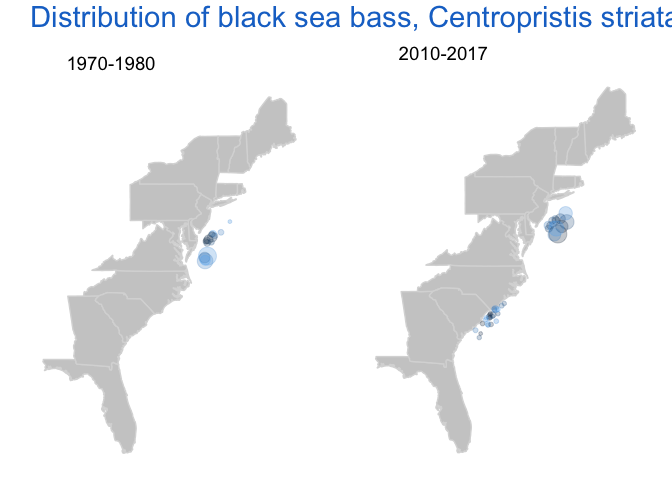

OceanAdapt at Rutgers University
================
Dr. Malin Pinsky <malin.pinsky@rutgers.edu>

------------------------------------------------------------------------

www.oceanadapt.rutgers.edu
==========================

**OceanAdapt is a collaboration between the Pinsky Lab of Rutgers University and the National Marine Fisheries Service (NMFS).**

We provide information about the impacts of changing climate and other factors on the distribution of marine life to the National Climate Assessment, fisheries communities, policymakers, and to others.

This website hosts an annually updated database of scientific surveys in the United States and provides tools for exploring changes in marine fish and invertebrate distributions. We are continually working to expand the site with new data and visualization tools.

-   Size of the circles represent the mean weight per catch effort
-   Color of the circles represent the year of catch with darker being older
-   Location of circled represent the mean latitude and logitude for each year.
